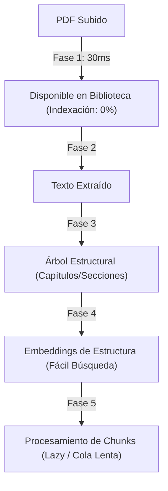
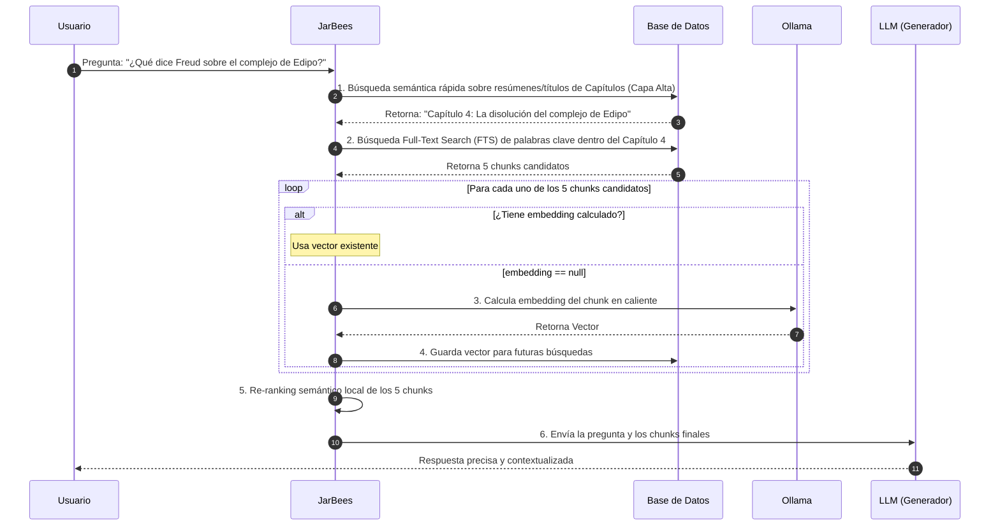

# Propuesta de Arquitectura: Ingesta Jerárquica, Incremental y Embeddings Perezosos

Este documento detalla la evolución del sistema de ingesta de JarBees, transformando el RAG plano tradicional en una **Biblioteca de Conocimiento Estructurado e Incremental**.

---

## 🎯 El Diagnóstico: Ingesta Atómica vs. Ingesta Incremental

La ingesta tradicional de PDFs en los sistemas de RAG trata a los documentos como un *blob* de texto continuo y genera miles de embeddings costosos de forma atómica ("todo o nada") antes de marcar el archivo como disponible. Esto introduce ineficiencias críticas:
1. **Monopolización de Recursos**: Una sola operación de gran volumen mantiene el hardware local al 100% (CPU/GPU) y bloquea o ralentiza la capacidad de JarBees para responder otros chats interactivos en tiempo real.
2. **Resúmenes Sesgados**: Resumir cortando arbitrariamente a los primeros $N$ caracteres ignora la totalidad de la obra.
3. **Pérdida de Contexto Jerárquico**: Tratar el contenido como un conjunto plano de 15,000 fragmentos inconexos diluye el sentido y aumenta las alucinaciones.

### El Cambio de Paradigma: La Ingesta Incremental
La evolución natural de JarBees no es evitar el procesamiento de archivos grandes, sino **desacoplar el pipeline** para que cada etapa produzca valor por sí sola y el libro esté disponible casi de inmediato:



---

## 🔄 1. Ingesta Asíncrona en 5 Fases

Dividimos el procesamiento en fases desacopladas de baja prioridad para asegurar que el sistema interactivo de JarBees siga respondiendo al instante:

### Fase 1: Registro Express (Disponibilidad en 30ms)
*   **Acción**: Lee la cabecera del archivo, extrae metadata básica (título, autor, páginas) y guarda el registro en la base de datos en estado `🟢 Disponible` pero con `indexacion = 0%`.
*   **Valor**: El usuario ve su libro disponible en su estantería de inmediato.

### Fase 2: Extracción y Limpieza
*   **Acción**: En segundo plano, se extrae el texto completo y se guarda en la base de datos.

### Fase 3: Identificación Estructural (El Libro como Árbol)
*   **Acción**: El parser identifica el índice o estructura del libro (Partes → Capítulos → Secciones).
*   **Estructura**:
    *   **Título, Autor e Índice**: Se identifican como nodos prioritarios.
    *   **Filtrado Inteligente de Ruido**: Se excluyen de la indexación semántica secciones de bajo valor informativo como la bibliografía, índices de términos, glosarios y notas editoriales redundantes (reducción del 10% al 20% en volumen).

### Fase 4: Cola de Embeddings de Baja Prioridad y Amortiguada
*   **Foco en la Estructura**: Se generan embeddings inmediatos únicamente para el nivel macro: **Título del Libro, Capítulos y Subcapítulos** (generalmente <100 vectores por libro).
*   **Cola Amortiguada para Chunks**: Para el contenido restante, los embeddings se procesan mediante una cola de baja prioridad y en pequeños lotes controlados con pausas (ej. generar 5 embeddings $\rightarrow$ pausa de 2 segundos $\rightarrow$ generar 5 embeddings). Esto evita la monopolización de la CPU/GPU.

### Fase 5: Enriquecimiento Semántico y Resúmenes Recursivos
*   **Resúmenes por Capítulos**: El LLM lee y resume cada capítulo de forma aislada.
*   **Meta-Resumen**: Se combinan los resúmenes de los capítulos para generar la sinopsis general de la obra, evitando el sesgo de las primeras páginas.

---

## 💤 2. Embeddings Perezosos (Lazy Embeddings)

No es necesario generar embeddings del 100% de los chunks del libro. Implementamos un sistema de calentamiento bajo demanda:

1.  **Chunks Iniciales sin Vector**: Al guardar los chunks en la base de datos, su campo `embedding` queda en `null`.
2.  **Búsqueda en Dos Capas**:
    *   **Capa Semántica Estructural (Macro)**: Se busca sobre los embeddings de los títulos de capítulos y secciones (búsqueda extremadamente rápida sobre una base de datos muy pequeña).
    *   **Capa Textual Fina (FTS - Full-Text Search)**: Se realiza una búsqueda textual clásica (usando `tsvector` en PostgreSQL o FTS en SQLite) sobre los chunks del capítulo identificado.
3.  **Cálculo en Caliente (On-Demand)**:
    *   Al extraer los 5 chunks candidatos más relevantes mediante FTS:
    *   Si alguno no tiene embedding calculado, se genera en caliente durante la consulta y se guarda en base de datos.
    *   Con el uso del usuario, la biblioteca se va "calentando" de manera selectiva.

---

## 🗄️ 3. Modelo de Datos Propuesto (Prisma Schema con Métricas)

```prisma
model Book {
  id               Int       @id @default(autoincrement())
  title            String
  author           String?
  status           String    @default("disponible") // "disponible" | "procesando"
  progressIndex    Float     @default(0.0)  // % de texto extraído y estructurado
  progressEmbed    Float     @default(0.0)  // % de chunks con embedding generado
  progressSummary  Float     @default(0.0)  // % de capítulos con resumen generado
  summary          String?   // Meta-resumen final del libro
  chapters         Chapter[]
  createdAt        DateTime  @default(now())
}

model Chapter {
  id          Int       @id @default(autoincrement())
  bookId      Int
  title       String
  order       Int
  summary     String?   // Resumen individual de este capítulo
  embedding   Unsupported("vector(1024)")? // Embedding macro de la temática del capítulo
  sections    Section[]
  book        Book      @relation(fields: [bookId], references: [id], onDelete: Cascade)
}

model Section {
  id          Int       @id @default(autoincrement())
  chapterId   Int
  title       String
  summary     String?
  embedding   Unsupported("vector(1024)")?
  chunks      Chunk[]
  chapter     Chapter   @relation(fields: [chapterId], references: [id], onDelete: Cascade)
}

model Chunk {
  id          Int       @id @default(autoincrement())
  sectionId   Int
  content     String
  embedding   Unsupported("vector(1024)")? // Calculado PEREZOSAMENTE (Lazy)
  section     Section   @relation(fields: [sectionId], references: [id], onDelete: Cascade)
}
```

---

## 🚀 4. Flujo de Consulta Jerárquica + FTS + Lazy

Supongamos que el usuario pregunta: *¿Qué dice Freud sobre el complejo de Edipo?*



---

## 📅 Plan de Acción para Implementación en Casa

### Paso 1: Estados y Métricas en BD
*   Actualizar los modelos de base de datos para soportar los nuevos campos de progreso y estructura jerárquica.
*   Habilitar al agente JarBees para trabajar y realizar búsquedas híbridas (semántica + FTS) sobre documentos en indexación parcial.

### Paso 2: Parser Jerárquico de Libros y Filtro de Ruido
*   Desarrollar reglas de parseo para identificar capítulos y secciones a partir del índice del libro.
*   Implementar exclusión inteligente de páginas y chunks que correspondan a bibliografía y notas editoriales redundantes.

### Paso 3: Lógica de Cola Lenta y Lazy Embeddings
*   Reescribir `processDocumentEmbeddings` para que opere en segundo plano utilizando una cola con `setTimeout` o mecanismos de amortiguación (lotes pequeños de 5 con pausas).
*   Programar el cálculo dinámico de embeddings en caliente en la capa de consultas cuando se obtienen candidatos por FTS con `embedding == null`.

### Paso 4: Resumen Recursivo MapReduce
*   Configurar el pipeline de resúmenes por capítulo para construir progresivamente la visión macro del libro sin truncar el contenido inicial.
