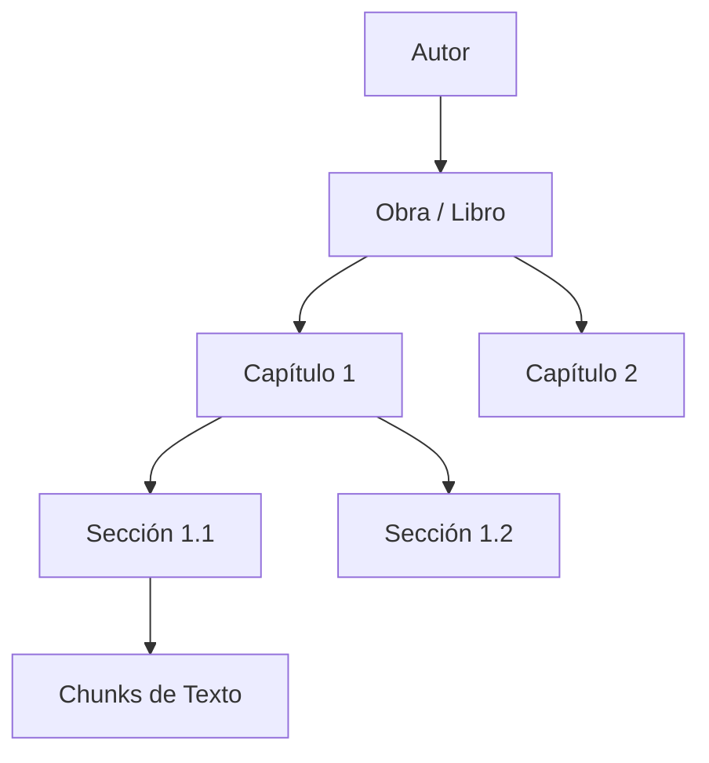
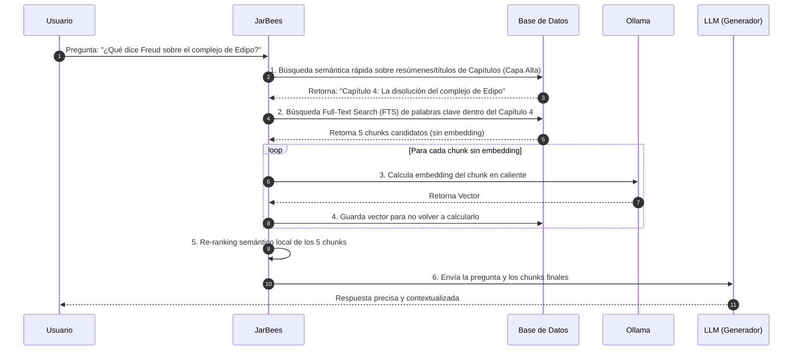

# Propuesta de Arquitectura: Ingesta Jerárquica y Embeddings Perezosos (Lazy Embeddings)

Este documento detalla la reingeniería del sistema de ingesta de JarBees, transformando el RAG plano tradicional en una **Biblioteca de Conocimiento Estructurado**. 

---

## 🎯 El Diagnóstico: Del Flat-RAG a la Estructura de Biblioteca

La ingesta tradicional de PDFs en los sistemas de RAG trata a los documentos como un *blob* de texto continuo y genera miles de embeddings costosos por adelantado. Esto introduce ineficiencias críticas:
1. **Desperdicio de Recursos**: El usuario solo consulta un pequeño porcentaje (ej. 5%) de una obra de gran volumen.
2. **Resúmenes Sesgados**: Resumir cortando a los primeros $N$ caracteres ignora la totalidad de la obra.
3. **Pérdida de Contexto Semántico**: Buscar en un mar de 15,000 fragmentos inconexos diluye el sentido y aumenta las alucinaciones.

### El Nuevo Paradigma: El Libro como Árbol de Conocimiento
Proponemos estructurar los libros de forma jerárquica y procesar la información de forma perezosa (lazy) e incremental:



---

## 🔄 1. Ingesta Asíncrona en 5 Fases

En lugar de un pipeline lineal síncrono que bloquea la disponibilidad del archivo, dividimos el procesamiento en fases desacopladas:

### Fase 1: Registro Express (Disponibilidad en 30ms)
*   **Acción**: Lee la cabecera del archivo, extrae metadata básica (título, autor, tamaño, páginas) y guarda el registro en la base de datos en estado `READY` para su visualización.
*   **Experiencia de Usuario**: El archivo aparece listado inmediatamente en la biblioteca de JarBees.

### Fase 2: Extracción y Limpieza
*   **Acción**: En segundo plano, se extrae el texto completo y se guarda estructurado en texto plano sanitizado.

### Fase 3: Estructuración y Árbol de Contenido
*   **Acción**: El parser identifica el índice o estructura del libro (Partes → Capítulos → Secciones) mediante reglas de formato, expresiones regulares o un paso rápido por el LLM. Se inserta el árbol jerárquico en la base de datos.

### Fase 4: Generación de Embeddings en Lotes Controlados (Carga Amortiguada)
*   Para los elementos que sí requieren embeddings inmediatos (ej. títulos de capítulos y secciones):
    *   Se procesan en lotes pequeños (ej. 50 chunks).
    *   Se introduce una pausa de enfriamiento entre lotes para mantener la CPU/GPU liberada.
    *   No interrumpe el uso interactivo del asistente.

### Fase 5: Enriquecimiento Semántico y Resúmenes Recursivos
*   **Resúmenes por Capítulos**: El LLM genera un resumen por cada capítulo del libro.
*   **Meta-Resumen**: Se combinan los resúmenes de los capítulos para generar el resumen general del libro.
*   **Extracción de Conceptos**: Se asocian palabras clave y relaciones transversales entre autores.

---

## 💤 2. Embeddings Perezosos (Lazy Embeddings)

No es necesario generar embeddings del 100% de los chunks. Implementamos un sistema híbrido inspirado en un caché de lectura caliente:

1.  **Chunks Iniciales sin Vector**: Al fragmentar el libro, todos los registros `Chunk` se guardan con `embedding = null`.
2.  **Búsqueda en Dos Capas**:
    *   **Capa Semántica Alta**: Se busca en los embeddings de los **títulos de capítulos y secciones** (una base de datos muy pequeña de ~50 vectores).
    *   **Capa Textual Fina (Full-Text Search)**: Se realiza una búsqueda textual rápida (usando `tsvector`/`tsquery` de Postgres o FTS en Sqlite) sobre el contenido de los chunks dentro del capítulo/sección seleccionado.
3.  **Cálculo en Caliente (On-Demand)**:
    *   Cuando el motor identifica los 5 chunks candidatos a responder la pregunta del usuario:
    *   Si alguno no tiene embedding calculado, se llama al LLM local para generarlo en ese instante.
    *   Se guarda en la DB para futuras consultas.
    *   La base de conocimientos se va "calentando" gradualmente con el uso del usuario.

---

## 🗄️ 3. Modelo de Datos Propuesto (Prisma Schema)

```prisma
model Book {
  id        Int       @id @default(autoincrement())
  title     String
  author    String?
  summary   String?   // Resumen general recursivo
  chapters  Chapter[]
  createdAt DateTime  @default(now())
}

model Chapter {
  id          Int       @id @default(autoincrement())
  bookId      Int
  title       String
  order       Int
  summary     String?   // Resumen individual de este capítulo
  embedding   Unsupported("vector(1024)")? // Vector del capítulo (para búsqueda semántica de alto nivel)
  sections    Section[]
  book        Book      @relation(fields: [bookId], references: [id], onDelete: Cascade)
}

model Section {
  id          Int       @id @default(autoincrement())
  chapterId   Int
  title       String
  summary     String?
  embedding   Unsupported("vector(1024)")?
  chunks      Chunk[]
  chapter     Chapter   @relation(fields: [chapterId], references: [id], onDelete: Cascade)
}

model Chunk {
  id          Int       @id @default(autoincrement())
  sectionId   Int
  content     String
  embedding   Unsupported("vector(1024)")? // Se llena de forma PEREZOSA (Lazy)
  section     Section   @relation(fields: [sectionId], references: [id], onDelete: Cascade)
}
```

---

## 🚀 4. Flujo de Consulta: Paso a Paso

Supongamos que el usuario pregunta: *¿Qué dice Freud sobre el complejo de Edipo?*



---

## 📅 Plan de Acción para Implementación en Casa

### Paso 1: Adecuación de la Base de Datos
*   Aplicar la migración de Prisma con la estructura jerárquica (`Book`, `Chapter`, `Section`, `Chunk`).
*   Configurar el índice de búsqueda de texto completo (Full-Text Search) en la columna `content` de los chunks.

### Paso 2: Parser Jerárquico de Libros
*   Desarrollar un extractor de estructura que detecte índices de contenido.
*   Si el libro no posee un índice limpio, usar expresiones regulares para identificar patrones como `"Capítulo X"`, `"I. "`, `"II. "` u hojas de separación.

### Paso 3: Lógica de Carga y Embeddings Perezosos
*   Modificar `document-ingest.service.ts` para que inserte el libro, capítulos y secciones en el primer guardado (Fase 1 a 3).
*   Implementar el cálculo de embeddings en caliente dentro de la función de recuperación de RAG si la columna `embedding` es nula.

### Paso 4: Resumen Recursivo MapReduce
*   Escribir un servicio que tome los textos de los capítulos secuencialmente, genere un resumen de ~1500 caracteres para cada uno, y posteriormente envíe el bloque consolidado de resúmenes al LLM para obtener la visión global del libro.
